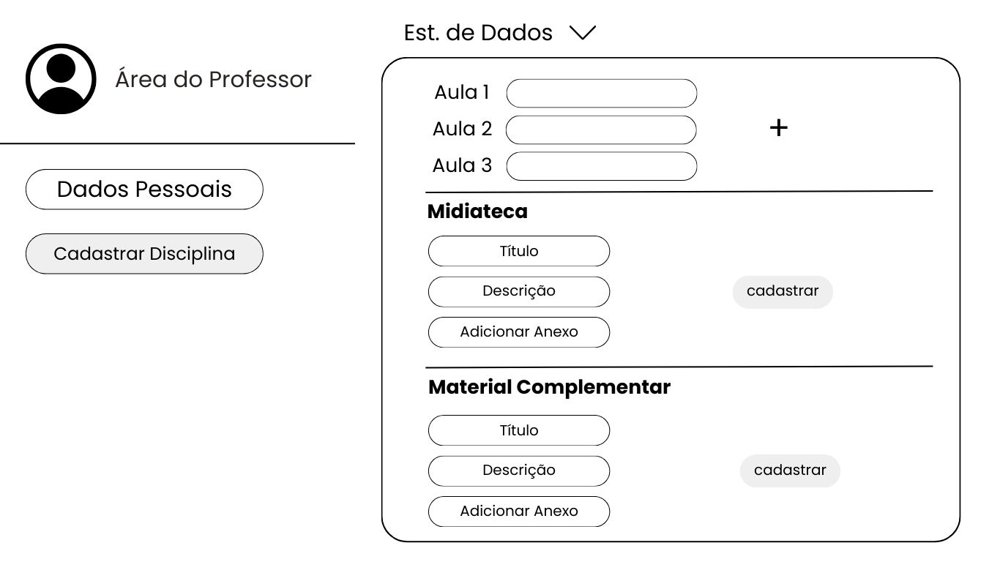
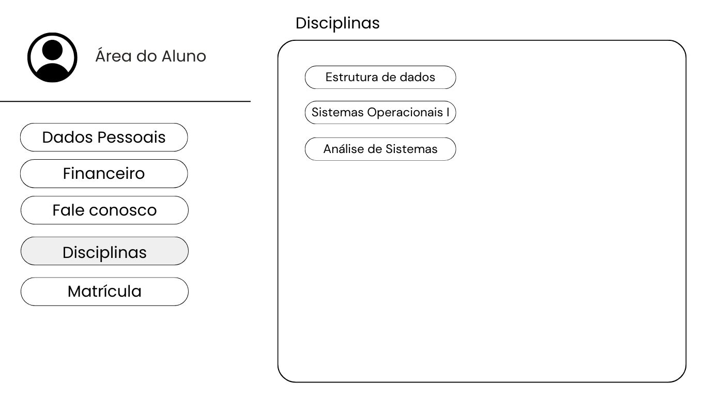
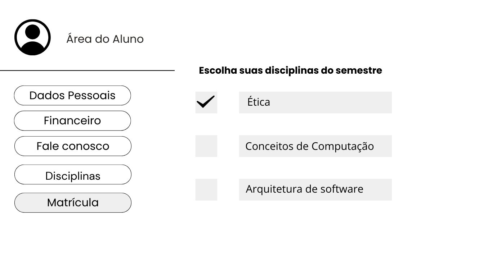
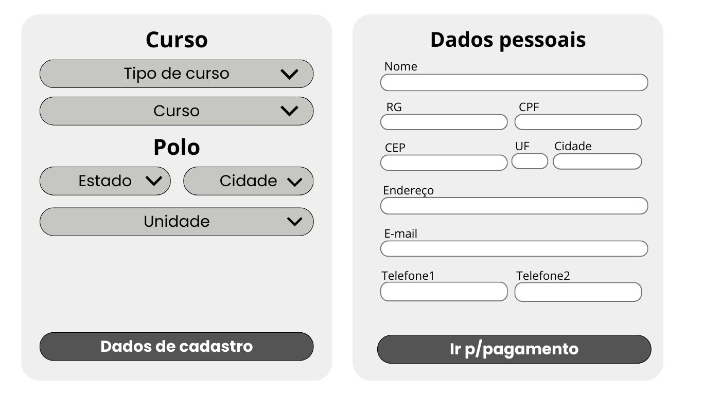
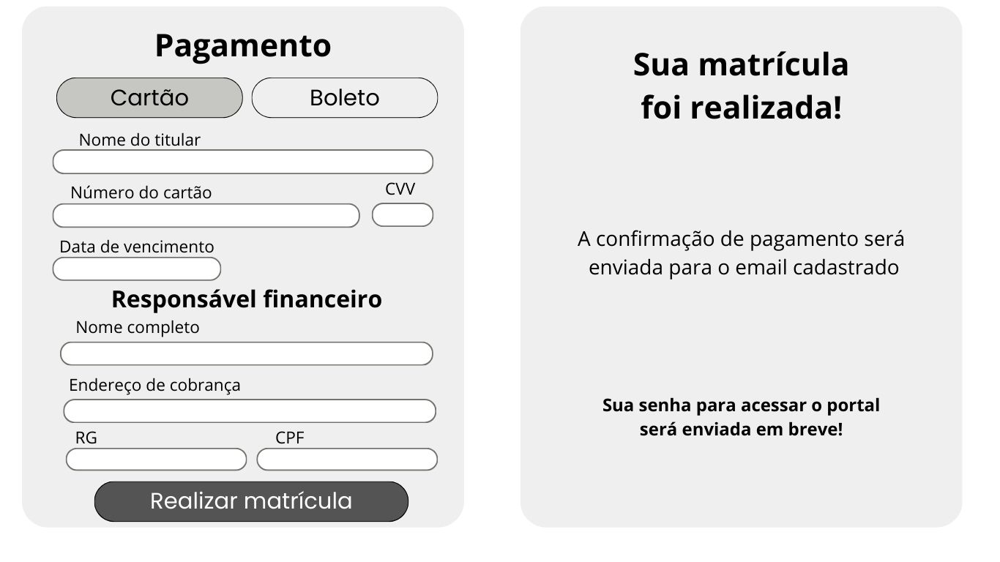

# Projeto Integrador Senac

## Integrantes
- Angelo Gustavo Vieira dos Santos
- Gleiciana de Oliveira Mota
- Lucas Almeida Campos
- Marinna Farias de Oliveira Lins Lima
- Tabata de Sando Angelo

# Telas

## Página Inicial

Resumo das informações para fornecer ao usuário um ponto de entrada lógico ao iniciar o uso do aplicativo.

## Login

Tela que autenticará o usuário e senha inseridos pelo usuário (aluno, professor…) para permitir acesso à plataforma.

## Área do professor

Tela de acesso restrito do professor, para garantir que apenas funcionários autorizados tenham acesso a determinados recursos. Local onde será inserido o conteúdo programado (aulas em vídeo, material de estudo, trabalhos, avaliações) e notas.

## Área do aluno

 Local onde estarão postados os conteúdos programados (aulas em vídeo, material de estudo, trabalhos, avaliações) e as notas.

Tela de acesso restrito do aluno, utilizada para proteger informações sensíveis e garantir que apenas aquele aluno tenha acesso a determinados recursos. Acesso ao setor administrativo e financeiro da instituição, para esclarecimento de dúvidas, emissão de boletos, renovação de matrícula em disciplinas, entre outras necessidades.

## Área de matrícula

Ao apertar no botão matrícula na página inicial, o usuário do sistema  será encaminhado para a tela “Curso”. Nesta tela ele optará pelo tipo de curso e curso de sua preferência e escolherá qual a melhor localização de polo educacional para alavancar seus estudos. Após essas escolhas, clicar no botão “Dados de cadastro”e prosseguirá para tela Dados pessoais.

Na tela “Dados pessoais” o usuário fará a inserção de seus dados pessoais: Nome, RG, CPF, endereço completo e número telefônico para contato. Após adicionar os dados necessários apertará o botão “Ir p/ pagamento” e será encaminhado para próxima tela.

Na tela “Pagamento” o usuário escolherá a forma de pagamento. Se optar por pagar com o cartão de crédito, será necessário a inserção do nome do usuário do cartão, número do cartão, data de vencimento do cartão, código CVV. Será necessário, também, adicionar os dados do responsável financeiro: nome, endereço completo, RG e CPF. Finalizando o preenchimento dos dados o usuário apertará o botão “realizar matrícula” e será encaminhado para próxima tela.

Na tela final da área de matrícula aparecerá uma mensagem informando “Sua matrícula foi realizada” e outras mensagens informando que a confirmação do pagamento e a senha para o acesso do usuário serão enviadas por email. 

