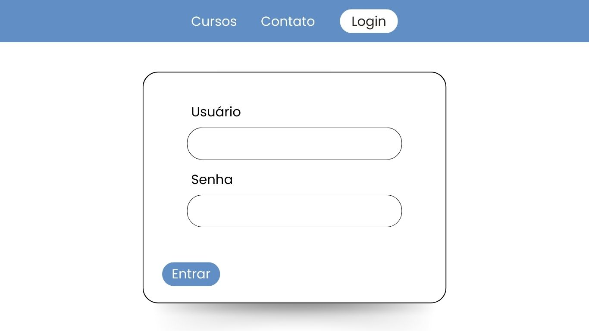

# Projeto Integrador Senac

## Integrantes
- Angelo Gustavo Vieira dos Santos
- Gleiciana de Oliveira Mota
- Lucas Almeida Campos
- Marinna Farias de Oliveira Lins Lima
- Tabata de Sando Angelo

# Telas

## Página Inicial

Resumo das informações para fornecer ao usuário um ponto de entrada lógico ao iniciar o uso do aplicativo.

## Login

Tela que autenticará o usuário e senha inseridos pelo usuário (aluno, professor…) para permitir acesso à plataforma.

## Área do professor

Tela de acesso restrito do professor, para garantir que apenas funcionários autorizados tenham acesso a determinados recursos. Local onde será inserido o conteúdo programado (aulas em vídeo, material de estudo, trabalhos, avaliações) e notas.

## Área do aluno

 Local onde estarão postados os conteúdos programados (aulas em vídeo, material de estudo, trabalhos, avaliações) e as notas.

Tela de acesso restrito do aluno, utilizada para proteger informações sensíveis e garantir que apenas aquele aluno tenha acesso a determinados recursos. Acesso ao setor administrativo e financeiro da instituição, para esclarecimento de dúvidas, emissão de boletos, renovação de matrícula em disciplinas, entre outras necessidades.

